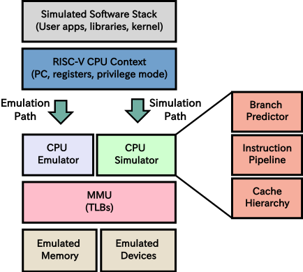

## MARSS-RISCV: Micro-Architectural System Simulator for RISC-V

MARSS-RISCV (Micro-ARchitectural System Simulator - RISCV) is an **open-source, cycle-accurate single-core full-system (Linux) micro-architectural simulator** for the [RISC-V](https://riscv.org/specifications/) ISA built on top of [TinyEMU emulator](https://bellard.org/tinyemu) developed by Fabrice Bellard and utilizes the configuration code, RISC-V CPU state, physical memory, MMU, and all the devices emulated by TinyEMU. 

It consists of detailed cycle-accurate models of a generic RISC-V In-order and Out-of-order processor with a branch prediction unit, TLBs, cache-hierarchy, and a simplistic DRAM model. It comes integrated with [DRAMSim2](https://github.com/umd-memsys/DRAMSim2), a cycle-accurate memory system simulator. It can simulate the entire RISC-V software stack (from the bootloader and kernel to the user level applications, including system calls) cycle-by-cycle along with the real-time I/O without any modifications and provides simulation statistics for all the RISC-V CPU privilege modes (user, supervisor, hyper-visor and machine). Hence, it makes MARSS-RISCV, a full system simulation framework that simulates an entire RISC-V system-on-a-chip (SoC) comprising cycle-accurate models of CPU, DRAM, network, and peripheral devices. 

It is currently being developed and maintained by [CAPS](https://github.com/bucaps/) (Computer Architecture and Power-Aware Systems Research Group) at the State University of New York at Binghamton. Our simulator is currently in alpha status as we are validating the cycle accuracy using various development boards. The figure below shows a high-level overview of the MARSS-RISCV simulation framework.

<p align="center">
  
</p>

## Table of contents
- [Features](#features)
- [Getting started with the simulator running a Linux guest](#getting-started-with-the-simulator-running-a-linux-guest)
- [Running full system simulations](#running-full-system-simulations)
- [Viewing live simulation stats](#viewing-live-simulation-stats)
- [Generating simulation trace](#generating-simulation-trace)
- [Future work](#future-work)
- [Technical notes](#technical-notes)
- [Authors](#authors)
- [Acknowledgment](#acknowledgment)
- [License](#license)

## Features 
- **Full system simulator** which simulates the entire system in a cycle-accurate fashion, including the bootloader, kernel, libraries, interrupt handlers, and user-level applications
- **Configurable RISC-V CPU** with cycle-accurate, in-order and out-of-order processor models
- **Multiple execution units** with configurable latencies (execution units can be configured to run iteratively or in a pipelined fashion)
- **Simulates memory access delay for instructions, data and page table walk** via three direct-mapped TLBs (for code, loads and stores), two-level cache hierarchy with various allocation and miss handling policies and two DRAM memory models: Simplistic base DRAM model that simulates open-page hits and [DRAMSim2](https://github.com/umd-memsys/DRAMSim2)
- **Branch predictor** which supports Bi-modal and 2-level adaptive (Gshare, Gselect, GAg, GAp, PAg, PAp) predictors and a Return address stack (RAS)
- **RISC-V ISA support** includes `RV32GC` and `RV64GC` (user-level ISA version `2.2`, privileged architecture version `1.10`)
- **Emulated devices** include standard platform-level interrupt controller (PLIC), core local interrupter (CLINT), real-time clock device (RTC), universal asynchronous receiver/transmitter (UART), VirtIO, network, block device, and 9P filesystem
- **Single JSON configuration file** to configure TinyEMU and simulator parameters, specify RISC-V BIOS and kernel individually
- **Easy to install, use and hack** with a small codebase

For more details regarding the microarchitecture of the simulated CPU, branch predictor, memory hierarchy and simulator configuration, refer to [MARSS-RISCV Docs](https://marss-riscv-docs.readthedocs.io/en/latest/)

## Getting started with the simulator running a Linux guest

### System requirements
* 32-bit or 64-bit Linux machine
* Libcurl, OpenSSL and SDL Libraries
* Standard C and C++ compiler

### Installing the dependencies
Make sure that you have all the dependencies (`ssl`, `sdl`, and `curl` libraries) installed on the system. For Debian-based (including Ubuntu) systems, the packages are: `build-essential`, `libssl-dev`, `libsdl1.2-dev`, `libcurl4-openssl-dev`. 
```console
$ sudo apt-get update
$ sudo apt-get install build-essential
$ sudo apt-get install libssl-dev
$ sudo apt-get install libsdl1.2-dev
$ sudo apt-get install libcurl4-openssl-dev
```
### Compiling the simulator

First, clone the simulator repository:

```console
$ git clone https://github.com/bucaps/marss-riscv
```
Then, `cd` into the simulator source directory:

```console
$ cd marss-riscv/src/
$ git submodule update --init --recursive
```
Set the `CONFIG_XLEN` variable in the Makefile to the desired `XLEN` as required. Supported `XLEN` values are `32` and `64`. Default is `64`.

Then, compile the simulator using:

```console
$ make
```

### Preparing the bootloader, kernel and userland image
The simplest way to start is by using a pre-built bootloader, kernel, and userland image. The pre-built 32-bit and 64-bit RISC-V userland, bootloader, and kernel are available here: [marss-riscv-images.tar.gz](https://cs.binghamton.edu/~marss-riscv/marss-riscv-images.tar.gz)

The userland image needs to be decompressed before running the simulator:

```console
$ wget https://cs.binghamton.edu/~marss-riscv/marss-riscv-images.tar.gz
$ tar -xvzf marss-riscv-images.tar.gz
$ cd marss-riscv-images/riscv64-unknown-linux-gnu/
$ xz -d -k -T 0 riscv64.img.xz
```

When decompression finishes, jump to the marss-riscv `src` folder and launch the simulator with:

```console
$ ./marss-riscv ../configs/riscv64_inorder_soc.cfg
```

Simulation and TinyEMU SoC parameters are configured using the TinyEMU JSON configuration file provided in the [configs](/configs) directory. We have provided sample configuration files for 64-bit RISC-V single-core in-order and out-of-order SoC. The following table provides a summary of various simulation related command-line options supported by MARSS-RISCV.

| Options                     | Arguments          | Description                                                                                                                                                                                                                                                                                      |
|-----------------------------|--------------------|--------------------------------------------------------------------------------------------------------------------------------------------------------------------------------------------------------------------------------------------------------------------------------------------------|
| `-rw`                       | -                  | By default, the simulator will boot in `snapshot` mode, meaning it will **not** retain the file system changes after it is shut down. In order to persist the changes, pass `-rw` command-line argument to the simulator.                                                                        |
| `-simstart`                 | -                  | By default, guest boots in emulation mode, to start TinyEMU (boot kernel) in simulation mode run with `-simstart` command-line option.                                                                                                                                                           |
| `-sim-stats-display`        | `posix-shm-name`   | Dump simulation performance stats to a shared memory location `posix-shm-name`, read by sim-stats-display tool.  First, open a new terminal before executing the simulator and launch `sim-stats-display` tool with `posix-shm-name` as an argument.  Then start the simulator on a different terminal with `-sim-stats-display` command-line option with `posix-shm-name` as an argument. |
| `-sim-mem-model`            | `base`, `dramsim2` | To specify which memory model to use, run with command line option `-sim-mem-model` and specify either `base` or `dramsim2`. The default is `base`. For DRAMSim2, the paths to `ini` and `system ini file` can be specified in the config file.                                                  |
| `-sim-flush-mem`            | -                  | Flush simulator memory hierarchy on every new simulation run                                                                                                                                                                                                                                     |
| `-sim-flush-bpu`            | -                  | Flush branch prediction unit on every new simulation run                                                                                                                                                                                                                                         |
| `-sim-file-path`            | `directory path`   | Path of the directory to store stats, log, and trace file. Default is current directory `.`, the user must create the directory before starting MARSS-RISCV.                                                                                                                                     |
| `-sim-file-prefix`          | `prefix`           | Prefix appended to stats, log, and trace file names. Default prefix used for all the simulator generated files is `sim_`                                                                                                                                                                         |
| `-sim-trace`                |                    | Generate instruction commit trace in during simulation. Trace is generated in file named `<sim-file-prefix>_trace.txt`                                                                                                                                                                           |
| `-sim-emulate-after-icount` | `icount`           | Switch to emulation mode after simulating `icount` instructions every time simulation starts.                                                                                                                                                                                                    |


It may also be desirable to increase the userland image (has roughly 200MB of available free space by default). More information about how to increase the size of the userland image is in the `readme.txt` file, which comes with the [images archive](https://cs.binghamton.edu/~marss-riscv/marss-riscv-images.tar.gz).

Once the guest boots, we need to initialize the environment. Normally, this should happen automatically, but due to an unresolved bug, it needs to done explicitly:

```console
# export PYTHONPATH=/usr/lib64/python2.7/site-packages/
# env-update
```

The system is ready for use and has a working GCC compiler, ssh, git, and virtual network interface. However, there is no host-to-guest routing, so it is not possible to ssh into the guest.

By default, `Ctrl-C` will not kill the simulator. The command `halt` will cleanly shutdown the guest. Alternatively, pass the `-ctrlc` command-line argument to the simulator, which will allow it to be killed using `Ctrl-C`.

After gaining access to the guest machine terminal, refer to the next section for running simulations.

## Running full system simulations

### Using checkpoints
The simulator supports two distinct custom instructions, `SIM_START()` and `SIM_STOP()`, which inform MARSS-RISCV to enable and disable simulation mode, respectively, when encountered during instruction processing.  To implement these instructions, we have used two different unused registers from user mode CSR address space, `0x800`, and `0x801`. When the simulation is disabled, MARSS-RISCV runs in the emulation mode. 

With these two custom instructions as checkpoints, it is possible to simulate any section in the source code. However, after inserting these markers, the source code must be recompiled inside the guest OS using the installed GCC toolchain.  Alternatively, users can compile the programs on their host machine using the RISC-V toolchain and import them onto the disk image.

After the simulator executes `SIM_STOP()` instruction, simulation mode is disabled, and all the performance stats are saved in the file `sim_stats_file` as configured in the simulator configuration file.  The code below shows a simple hello world program with checkpoints instructions. 

```c
/* hello_world.c */

#include <stdio.h>

#define SIM_START() asm("csrs 0x800,zero")
#define SIM_STOP() asm("csrs  0x801,zero")

int main()
{
  SIM_START();
  printf("Hello World\n");
  SIM_STOP();
  return 0;
}
```

### Using the simulate script
Alternatively, users can use the simulation script (`simulate.c`) provided [here](https://github.com/bucaps/marss-riscv-utils/blob/master/simulate.c), which forks a child process. The child enters the simulation mode and execs the command. The parent process waits for the child to complete and then switches MARSS-RISCV back to emulation mode. With this script, it is possible to simulate any program without the need to modify and recompile the source code. Since the child switches to simulation mode before calling `exec()`, `exec()` also runs in the simulation. Hence, performance statistics generated at the end of the simulation will also include stats for `exec()`.

### Running benchmarks
We have provided a detailed step-by-step comprehensive tutorial [here](https://marss-riscv-docs.readthedocs.io/en/latest/sections/running-full-system.html) to run the benchmarks on the simulator. This tutorial configures MARSS-RISCV to simulate a simple 5-stage 32-bit in-order RISC-V processor and run [CoreMark](https://github.com/eembc/coremark), an industry-standard benchmark that measures the performance of central processing units (CPU) and embedded microcontrollers (MCU).

## Viewing live simulation stats
Users can view live simulation stats using the provided `sim-stats-display` tool. First, open a new terminal before executing the simulator and launch `sim-stats-display` with a shared memory name of the user's choice as an argument:

```console
$ ./sim-stats-display marss-riscv-test-shm
```
Then launch the simulator on a different terminal with `-sim-stats-display marss-riscv-test-shm` command-line option.

## Generating simulation trace
To generate instruction, commit trace of the programs running in the simulation, run MARSS-RISCV with `-sim-trace` command-line option. Generated trace is saved in the file `sim_trace_file`, as configured in the simulator configuration file.

Sample trace generated is shown below:
```bash
cycle=112 pc=0x6aaaadf8 insn=0x85be863a c.mv a2,a4 mode=PRV_U
cycle=113 pc=0x6aaaadfa insn=0x250385be c.mv a1,a5 mode=PRV_U
cycle=115 pc=0x6aaaadfc insn=0xfa842503 lw a0,s0,-88 mode=PRV_U

```

## Technical notes
This section refers to technical notes for [TinyEMU](https://bellard.org/tinyemu). For simulator specific technical details refer: [MARSS-RISCV Docs](https://marss-riscv-docs.readthedocs.io/en/latest/)

### Floating point emulation
The floating-point emulation is bit-exact and supports all the specified instructions for 32-bit and 64-bit floating-point numbers. It uses the new SoftFP library.

### HTIF console
The standard HTIF console uses registers at variable addresses, which are deduced by loading specific ELF symbols. TinyEMU does not rely on an ELF loader, so it is much simpler to use registers at fixed addresses (0x40008000). A small modification was made in the "riscv-pk" boot loader to support it. The HTIF console is only used to display boot messages and to power off the virtual system. The OS should use the VirtIO console.

### Network usage
The easiest way is to use the "user" mode network driver. No specific configuration is necessary. TinyEMU also supports a "tap" network driver to redirect the network traffic from a VirtIO network adapter. You can look at the ``netinit.sh`` script to create the tap network interface and to redirect the virtual traffic to the Internet through a NAT. The exact configuration may depend on the Linux distribution and local firewall configuration. The TinyEMU configuration file must include:

``eth0: { driver: "tap", ifname: "tap0" }``

Furthermore, configure the network in the guest system with:
```console
$ ifconfig eth0 192.168.3.2
$ route add -net 0.0.0.0 gw 192.168.3.1 eth0
```

### Network filesystem
TinyEMU supports the VirtIO 9P filesystem to access local or remote filesystems. For remote filesystems, it makes HTTP requests to download the files. The protocol is compatible with the vfsync utility. In the ``mount`` command, ``/dev/rootN`` must be used as a device name where ``N`` is the index of the filesystem. When ``N=0``, it is omitted.

The build_filelist tool builds the file list from a root directory. A simple web server is enough to serve the files. The ``.preload`` file gives a list of files to preload when opening a given file.

### Network block device
TinyEMU supports an HTTP block device. The disk image is split into small files. Use the ``splitimg`` utility to generate images. The URL of the JSON blk.txt file must be provided as a disk image filename.

## Authors
* Copyright (c) 2017-2020 Gaurav Kothari {gkothar1@binghamton.edu}
* Copyright (c) 2018-2019 Parikshit Sarnaik {psarnai1@binghamton.edu}

TinyEMU:
* Copyright (c) 2016-2019 Fabrice Bellard

## Acknowledgment
* This work was supported in part by DARPA through an award from the SSITH program. 
* Thanks to Fabrice Bellard for the development of TinyEMU. 
* We want to thank Gokturk Yuksek, Ravi Theja Gollapudi, and Kanad Ghose for assistance with the internal details of TinyEMU and the development of the MARSS-RISCV simulator.
* Thanks to all the people working on the RISC-V project.
* For DRAMSim2, refer [here](https://github.com/umd-memsys/DRAMSim2).

## License
* This project is licensed under the MIT License - refer to the [LICENSE.md](LICENSE.md) file for details.
* The SLIRP library has a two clause BSD license.
* DRAMSim2 has a two clause BSD license.
